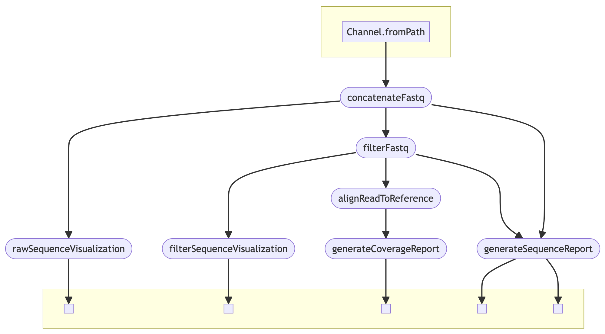

# amplimap-nf

**AmpliMap** is a bioinformatic pipeline for aligning amplicon reads to a DNA database. This pipeline is based on Nextflow.

## Getting started

### Prerequisites
- [Nextflow](https://nf-co.re/docs/usage/installation)
- [Miniconda](https://docs.conda.io/projects/miniconda/en/latest/miniconda-install.html) or [Anaconda](https://docs.anaconda.com/free/anaconda/install/index.html)

### Installation

```shell
git clone https://github.com/chaoatic/amplimap-nf.git
cd amplimap-nf
```

### Usage

```
Usage: nextflow run amplimap.nf [OPTION...]

Mandatory arguments:
    --data_dir      Path to sequences directory with sequences in fastq.gz format
    --db            Path to database file with sequences in fasta format
    --result_dir    Path to directory containing results

Optional arguments:
    --min_length    Minimum length (bp) for a read to be retained
                    [Default: 1]
    --max_length    Maximum length (bp) for a read to be retained
                    [Default: 2147483647]
    --min_qscore    Minimum average PHRED score for a read to be retained
                    [Default: 1]
    --threads       Number of parallel threads to use
                    [Default: 4]
```

### Example usage

```
nextflow run amplimap.nf \
    --data_dir "/DATA/DIRECTORY" \
    --db DB.fasta \
    --result_dir "/RESULT/DIRECTORY" \
    --min_length 500 \
    --max_length 1000 \
    --min_qscore 10 \
    --threads 4
```

## Overview



This pipeline is composed of a set of processes to compare amplicon reads against a reference database, then produce a coverage report for each sample.

- **concatenateFastq**: import all fastq files and concatenate them together into each barcode.
- **rawSequenceVisualization**: produce graphs and data visualizations of raw read sequences for each barcode.
- **filterFastq**: filter reads according to parameters provided.
- **filterSequenceVisualization**: produce graphs and data visualizations of filtered read sequences.
- **generateSequenceReport**: generate statistic report of each barcode sequence.
- **generateCoverageReport** generate coverage report of each barcode sequence.

## Citation

If you use this pipeline please cite:

- Wouter De Coster, Rosa Rademakers, NanoPack2: population-scale evaluation of long-read sequencing data, *Bioinformatics*, Volume 39, Issue 5, May 2023, btad311, https://doi.org/10.1093/bioinformatics/btad311
- Heng Li, Minimap2: pairwise alignment for nucleotide sequences, *Bioinformatics*, Volume 34, Issue 18, September 2018, Pages 3094–3100, https://doi.org/10.1093/bioinformatics/bty191
- Shen W, Le S, Li Y, Hu F (2016) SeqKit: A Cross-Platform and Ultrafast Toolkit for FASTA/Q File Manipulation. PLOS ONE 11(10): e0163962. https://doi.org/10.1371/journal.pone.0163962
- Twelve years of SAMtools and BCFtools
Petr Danecek, James K Bonfield, Jennifer Liddle, John Marshall, Valeriu Ohan, Martin O Pollard, Andrew Whitwham, Thomas Keane, Shane A McCarthy, Robert M Davies, Heng Li
*GigaScience*, Volume 10, Issue 2, February 2021, giab008, https://doi.org/10.1093/gigascience/giab008